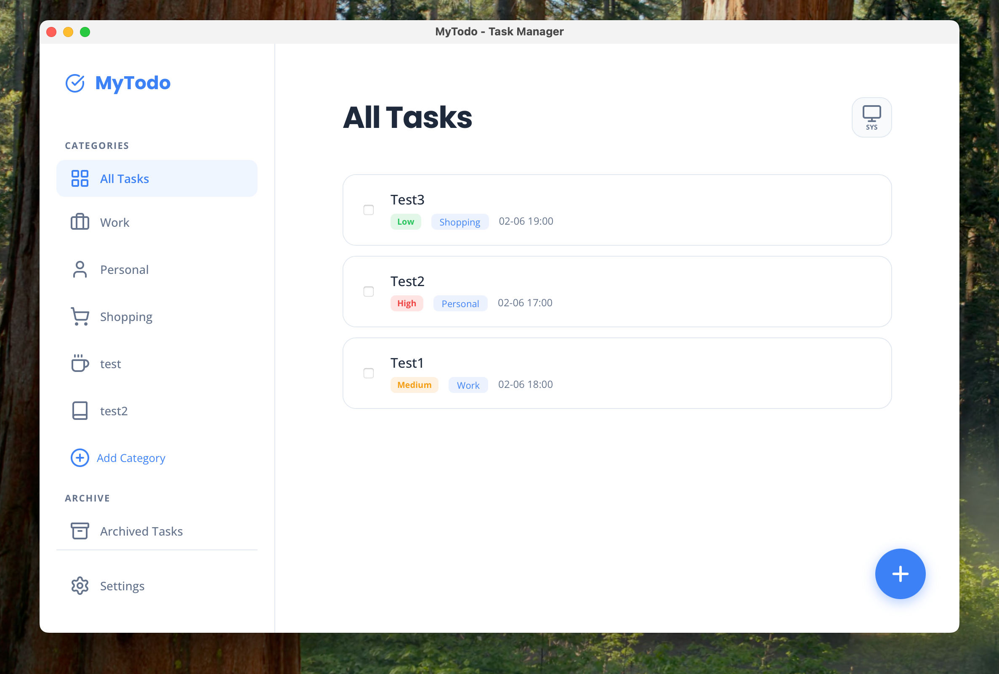
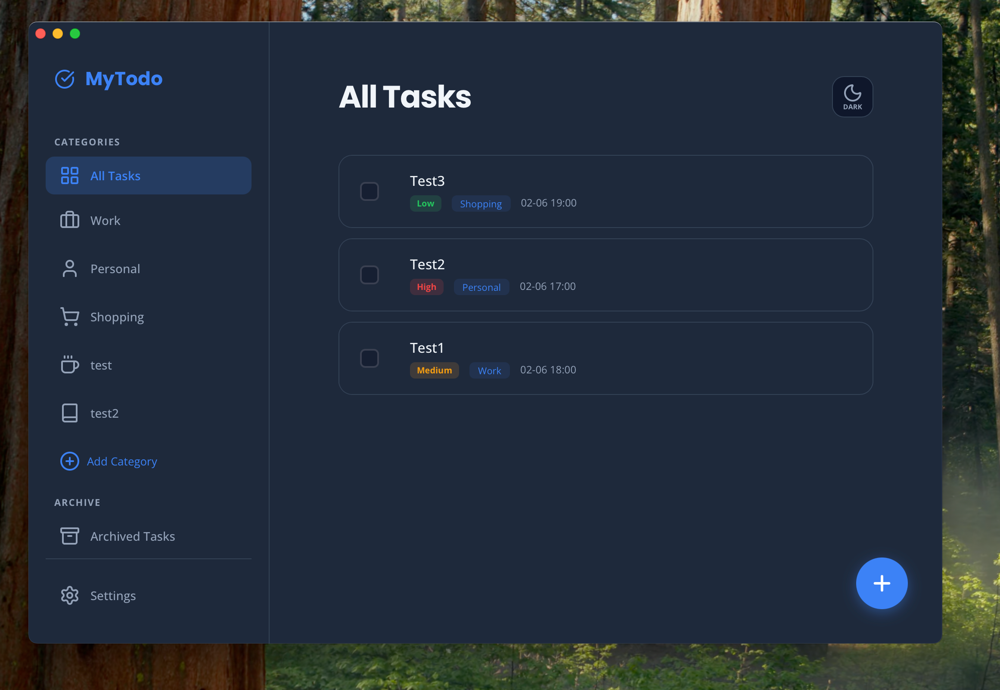

<h1 align="center">MyTodo ✅</h1>

<div align="center">
  A minimalist, secure, local-first Todo application built with Tauri.
</div>

<br />

<div align="center">
  
</div>

<br />

<div align="center">
  <h3>Your Personal Productivity Assistant</h3>
  <p>More than just a todo list—it's a minimalist philosophy for mastering your life.</p>
</div>

<div align="center">
  
  
  
  
  
</div>

<p align="center">
  <a href="#-features">Features</a> • 
  <a href="#-installation">Installation</a> • 
  <a href="#-tech-stack">Tech Stack</a> • 
  <a href="#-project-structure">Structure</a>
</p>

<p align="center">
  <a href="./README.md">简体中文</a> | <b>English</b>
</p>

---

**MyTodo** is a modern desktop todo application built on **Tauri**. It abandons complex feature bloat, returning to the essence of task management by combining the extreme performance of **Rust** with the flexibility of modern Web design.

With built-in **Gist Cloud Sync** and **End-to-End Encryption**, you can enjoy the blazing speed of a native app while securely syncing data across devices without privacy concerns—**your data is completely in your control.**

<h2 align="center">🎨 Interface Preview</h2>

<div align="center">
  
  
</div>
<div align="center">
  <sub>Modern Theme Support (Light / Dark)</sub>
</div>

## ✨ Features

### 📝 Task Management
- **Quick Entry**: Fast support for adding tasks, setting deadlines, and times.
- **Categorization**: Custom task categories (Work, Personal, Shopping, etc.) with custom icon support.
- **Archiving**: One-click archiving of completed tasks to keep your daily list clean.
- **Interactive Experience**: Offers mobile-style **slide-to-delete** functionality and desktop-optimized hover actions.

### ☁️ Cloud Sync (Gist Sync)
- **Multi-Device Sync**: Sync data across devices via **GitHub Gist** or **Gitee Gist**.
- **Privacy First**: Built-in **End-to-End Encryption** (AES-like XOR + Base64) ensures your tokens and data are stored as ciphertext in the cloud.
- **Seamless Experience**: Simple configuration process with one-click upload/download.

### 🎨 Modern Design
- **Exquisite UI**: Utilizes modern design languages (Glassmorphism, smooth animations).
- **Theme Support**: Built-in Light and Dark modes with automatic system theme detection.
- **Internationalization**: Full support for **Simplified Chinese** and **English**, detecting system language automatically.

### 🔒 Data Security
- **Local First**: All data is stored locally by default and never passes through third-party servers.
- **Backup & Export**: Export/Import your complete data in JSON format at any time.

## 🚀 Installation

### Download
Please visit the [Releases Page](https://github.com/guanyang/MyTodo/releases) to download the latest installer for macOS (.dmg) or Windows (.exe).

### 💻 Local Development

If you are a developer, follow these steps to run the project:

1. **Prerequisites**:
   - Ensure you have [Rust](https://www.rust-lang.org/tools/install) installed.
   - Ensure you have Node.js installed.

2. **Install Dependencies**:
   ```bash
   npm install
   # Installs frontend toolchain dependencies
   ```

3. **Start Development Server**:
   ```bash
   cargo tauri dev
   ```
   This command starts both the frontend service and the Tauri window.

4. **Build for Production**:
   ```bash
   cargo tauri build
   ```
   The artifacts will be located in `src-tauri/target/release/bundle/`.

## 📂 Project Structure

```
.
├── .github/                # GitHub Actions Workflows
│   └── workflows/          
│       └── release.yml     # Automated release configuration
├── public/                 # Web Assets
│   ├── index.html          # Application entry HTML
│   ├── app.js              # Core business logic (Vanilla JS)
│   ├── style.css           # Global stylesheet
│   └── favicon.png         # App icon
├── src-tauri/              # Tauri Backend (Rust Environment)
│   ├── src/                # Rust Source Code
│   │   ├── main.rs         # Entry point
│   │   └── lib.rs          # Library and plugin registration
│   ├── capabilities/       # Permission configuration
│   ├── icons/              # Multi-platform app icons
│   ├── tauri.conf.json     # Tauri configuration
│   └── Cargo.toml          # Rust dependencies
├── CHANGELOG.md            # Changelog
└── README.md               # Chinese Documentation
```

## 🛠 Tech Stack

- **Frontend**: HTML5, Vanilla CSS3, JavaScript (No Framework)
- **Backend/Shell**: Tauri v2 (Rust)
- **Plugins**: Tauri Plugin Store, Shell, Dialog, FS
- **Iconography**: Lucide Icons
- **Sync**: GitHub/Gitee REST API

## 📝 License

MIT License
